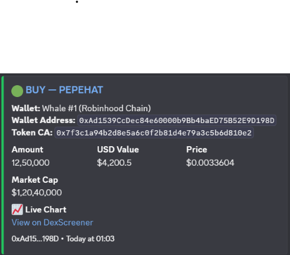
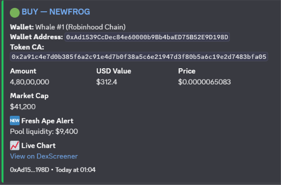
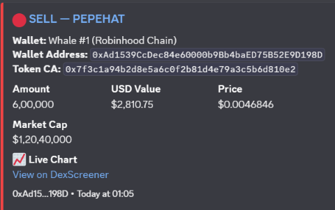
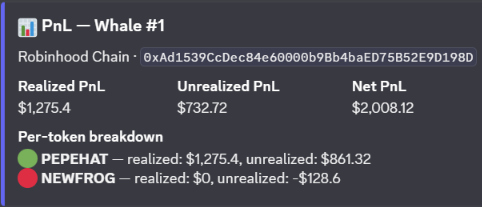

# Wallet Tracker Bot

[](https://github.com/Chaitu945/Wallet-Tracker-Bot/actions/workflows/ci.yml)


A Discord bot that watches crypto trader wallets across **Ethereum, BNB Chain, Polygon, Base, Arbitrum, Robinhood Chain and Solana**, posts an alert when a watched wallet buys or sells, flags when it apes into a brand-new token, and computes per-wallet PnL from the history it has observed.

Built as a self-directed project to work with third-party APIs, async polling, SQLite persistence, and accounting logic that has to stay correct across edge cases.

---

## Screenshots

Alerts are rendered by the bot's own embed builders. To keep the images reproducible without running live polling or spending API quota, they come from `npm run demo`, which feeds fixed fixtures through the same code path — see `docs/README.md`.

|                                                                                                           |                                                                                               |
| --------------------------------------------------------------------------------------------------------- | --------------------------------------------------------------------------------------------- |
| <br>**Buy alert** — amount, USD value, price, market cap and a chart link | <br>**Fresh ape** — flags a buy into a pool minutes old |
| <br>**Sell alert** — same shape, sell-coloured                          | <br>**`/pnl`** — realized and unrealized, per token                       |

_Sample data, not live signals._

---

## What it does

| Feature                  | Detail                                                                                         |
| ------------------------ | ---------------------------------------------------------------------------------------------- |
| **Trade alerts**         | Posts an embed per buy/sell with amount, USD value, price, market cap and a live chart link    |
| **Fresh-ape detection**  | Flags buys into pools younger than a configurable threshold (default 24h) using DexScreener    |
| **Per-wallet PnL**       | Realized + unrealized PnL per token, average-cost-basis, computed locally                      |
| **Multi-chain**          | EVM chains via Moralis, Solana via Moralis, Robinhood Chain via its own Alchemy-backed adapter |
| **Per-server isolation** | Wallets are scoped to the Discord server and channel they were added in                        |

---

## Architecture

```
                        ┌──────────────────────┐
                        │   Discord (slash)    │
                        └───────────┬──────────┘
                                    │ /track /untrack /pnl /wallets /rename
                        ┌───────────▼──────────┐
                        │      index.js        │  command loader + interaction router
                        └───────────┬──────────┘
                                    │
                        ┌───────────▼──────────┐
                        │   services/poller    │  node-cron, per-wallet watermark
                        └───────────┬──────────┘
                                    │
                 ┌──────────────────▼───────────────────┐
                 │            services/swaps            │  one entry point, three providers
                 └───────┬──────────────┬───────────────┘
                         │              │
           ┌─────────────▼───┐   ┌──────▼──────────────┐
           │ services/moralis│   │ services/robinhood  │
           │  (EVM/Solana)   │   │  (Alchemy transfers,│
           │                 │   │   grouped by tx)    │
           └─────────────┬───┘   └──────┬──────────────┘
                         │              │
                         └──────┬───────┘
                                │ normalized swap objects
                     ┌──────────▼───────────┐
                     │     db (SQLite)      │  wallets + observed trades
                     └──────────┬───────────┘
                                │
                     ┌──────────▼───────────┐
                     │  services/pnlMath    │  pure, unit-tested accounting
                     └──────────────────────┘
```

**Design notes**

- **`swaps.js` is the only dispatcher.** Every provider returns the same normalized swap shape, so the poller never learns which chain or vendor produced a row. Adding a chain is a config entry, not a new branch in the polling loop.
- **PnL math is pure.** `services/pnlMath.js` takes trades and an optional price lookup and returns the numbers — no DB, no network. That is what makes the accounting testable, and it is where the interesting bugs live (partial sells, average cost across multiple buys, sells of positions opened before tracking began).
- **Polling over webhooks.** Checks wallets on an interval instead of receiving webhooks, so the bot runs anywhere without a public URL.
- **Watermarks, not "recent" windows.** Each wallet stores the timestamp of the last trade seen; only strictly newer trades alert. The first poll backfills history silently so a newly-tracked wallet doesn't dump a wall of old alerts.
- **Fail-soft enrichment.** New-token and price lookups are best-effort: if DexScreener is down, alerts still fire, just without the extras.

---

## Testing

```bash
npm test
```

The suite uses Node's built-in test runner — no test framework to install. It covers the parts worth getting right:

- **Address validation** — per-chain format rules, including that Solana's base58 is case-sensitive while EVM addresses are not
- **P&L accounting** — round trips, partial sells, blended average cost, unrealized marks, oversells, and sells with no observed buy
- **Poll-interval → cron translation** — every returned expression is asserted against `node-cron` itself
- **Chain configuration** — every chain must be serviceable by the swap dispatcher, and the slash-command choices must stay inside Discord's 25-choice limit
- **Number formatting** — sub-cent USD values and very small token prices must stay readable and never fall back to scientific notation

---

## Commands

| Command                                                   | Description                                                          |
| --------------------------------------------------------- | -------------------------------------------------------------------- |
| `/track address:<addr> chain:<chain> nickname:<optional>` | Start tracking a wallet. Alerts post in the channel you run it from. |
| `/untrack address:<addr> chain:<chain>`                   | Stop tracking a wallet.                                              |
| `/wallets`                                                | List wallets tracked in this server.                                 |
| `/pnl address:<addr> chain:<chain>`                       | Realized / unrealized PnL per token.                                 |
| `/rename address:<addr> chain:<chain> nickname:<name>`    | Change or clear a wallet's nickname.                                 |

---

## Setup

**Requirements:** Node.js 20 or newer (node-cron 4 requires it).

1. **Install dependencies**

   ```bash
   npm install
   ```

2. **Create a Discord bot**
   - [Discord Developer Portal](https://discord.com/developers/applications) → New Application
   - **Bot** tab → Reset Token → copy it → `DISCORD_TOKEN`
   - **General Information** tab → copy Application ID → `DISCORD_CLIENT_ID`
   - **OAuth2 → URL Generator**: scopes `bot`, `applications.commands`; permissions `Send Messages`, `Embed Links`. Open the generated URL to invite the bot.

3. **Get a Moralis API key** — free tier at [moralis.com](https://moralis.com). One key covers every EVM chain and Solana.

4. **Get an Alchemy API key** — free at [dashboard.alchemy.com](https://dashboard.alchemy.com). Only needed for Robinhood Chain.

5. **Configure environment**

   ```bash
   cp .env.example .env
   # fill in DISCORD_TOKEN, DISCORD_CLIENT_ID, MORALIS_API_KEY, ALCHEMY_API_KEY
   ```

6. **Register the slash commands** (once, and again whenever commands change)

   ```bash
   npm run deploy-commands
   ```

7. **Start the bot**
   ```bash
   npm start
   ```

There is also `npm run dev` for a watch-mode run while developing.

---

## Deployment

This bot needs a **long-running process** and a **persistent disk**. That rules out serverless hosts — a Vercel/serverless deployment would be killed between requests and would lose the SQLite file on every cold start. Suitable hosts are a small VPS, Railway, Fly.io, or Render with a mounted volume.

---

## Configuration

| Variable                          | Default            | Purpose                                                    |
| --------------------------------- | ------------------ | ---------------------------------------------------------- |
| `DISCORD_TOKEN`                   | —                  | Bot token                                                  |
| `DISCORD_CLIENT_ID`               | —                  | Application ID, used to register commands                  |
| `MORALIS_API_KEY`                 | —                  | EVM + Solana swap data                                     |
| `ALCHEMY_API_KEY`                 | —                  | Robinhood Chain transfers                                  |
| `POLL_INTERVAL_MINUTES`           | `2`                | Poll cadence. `1-59` = minutes, `60/120/180` = whole hours |
| `NEW_TOKEN_AGE_THRESHOLD_MINUTES` | `1440`             | What counts as a "fresh ape"                               |
| `TRACKER_DB_PATH`                 | `./tracker.sqlite` | SQLite file location                                       |

### Adding a chain

Add an entry to `src/utils/chains.js`. If it is an EVM chain Moralis already indexes, that is the whole change — the dispatcher and validation pick it up from the existing `type`.

---

## Known limitations

- **PnL only knows what it saw.** It accounts from the moment you started tracking a wallet; trades before that are invisible to the cost basis. Sells of unseen positions count as proceeds with no cost basis rather than being dropped.
- **Unrealized PnL uses the current DexScreener price**, not a historical one, and is `null` when no pair is indexed yet.
- **Moralis free tier is request-capped.** Tracking many wallets on a short interval burns through it faster; raise `POLL_INTERVAL_MINUTES` or move to a paid tier.
- **Alchemy `getAssetTransfers` caps at 1000 transfers per call**, which bounds the Robinhood backfill window.
- **Robinhood swap direction is inferred** from which non-base token moved, because routers wrap ETH and the wallet is not always the direct counterparty of the base token.

---

## License

MIT
